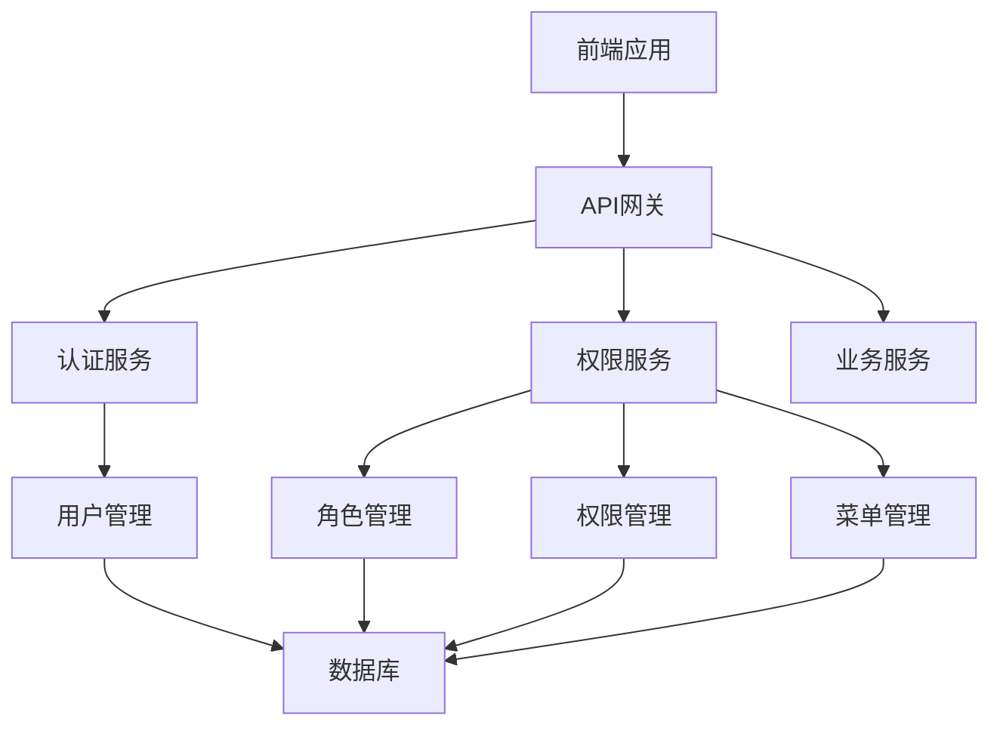

# 权限管理系统

## 1. 项目概述

权限管理系统是一个基于前后端分离架构的完整权限管理解决方案，采用基于角色的权限控制（RBAC）模型，实现了用户、角色、权限、菜单的管理和关联。系统通过JWT认证和权限验证中间件，确保了系统的安全性。前端采用动态菜单渲染，后端采用模块化设计，提高了系统的可维护性和扩展性。

## 2. 系统架构

### 2.1 整体架构



### 2.2 分层结构

- **前端层**：负责用户界面展示和交互
- **API网关层**：负责请求路由和认证拦截
- **服务层**：包括认证服务、权限服务和业务服务
- **数据层**：负责数据存储和管理

### 2.3 核心概念

- **用户**：系统的使用者
- **角色**：权限的集合
- **权限**：对资源的操作许可
- **菜单**：前端导航菜单
- **资源**：系统中的各种功能和数据

## 3. 技术栈

### 3.1 前端技术

- **框架**：Vue 3
- **状态管理**：Pinia
- **路由**：Vue Router
- **UI组件**：Element Plus
- **HTTP客户端**：Axios

### 3.2 后端技术

- **语言**：Python 3.12
- **框架**：FastAPI
- **数据库**：MySQL
- **缓存**：Redis
- **认证**：JWT
- **密码加密与验证**：bcrypt模块
- **ORM**：SQLAlchemy

## 4. 项目结构

### 4.1 前端项目结构

```
frontend/
├── public/              # 静态资源
│   ├── favicon.ico
│   └── index.html
├── src/                 # 源代码
│   ├── assets/          # 静态资源
│   │   ├── css/         # 样式文件
│   │   └── images/      # 图片资源
│   ├── components/      # 公共组件
│   ├── views/           # 页面组件
│   │   ├── dashboard/   # 首页
│   │   └── user/        # 用户管理
│   │       ├── UserList.vue       # 用户列表
│   │       ├── RoleList.vue       # 角色列表
│   │       ├── PermissionList.vue # 权限列表
│   │       └── MenuList.vue       # 菜单列表
│   ├── router/          # 路由配置
│   │   └── index.js     # 路由定义
│   ├── store/           # 状态管理
│   │   ├── modules/     # 模块状态
│   │   │   ├── user.js  # 用户状态
│   │   │   ├── role.js  # 角色状态
│   │   │   ├── permission.js # 权限状态
│   │   │   └── menu.js  # 菜单状态
│   │   └── index.js     # 状态管理配置
│   ├── api/             # API请求
│   │   ├── auth.js      # 认证相关
│   │   ├── user.js      # 用户相关
│   │   ├── role.js      # 角色相关
│   │   ├── permission.js # 权限相关
│   │   └── menu.js      # 菜单相关
│   ├── utils/           # 工具函数
│   │   ├── request.js   # 请求封装
│   ├── guards/          # 路由守卫
│   │   └── auth.js      # 认证守卫
│   ├── App.vue          # 根组件
│   └── main.js          # 入口文件
├── .env                 # 环境变量
├── package.json         # 项目配置
├── vite.config.js       # Vite配置
└── README.md            # 项目说明
```

### 4.2 后端项目结构

```
backend/
├── app/                 # 应用目录
│   ├── __init__.py      # 包初始化文件
│   ├── api/             # API路由
│   │   ├── __init__.py  # 包初始化文件
│   │   ├── v1/          # API版本
│   │   │   ├── __init__.py  # 包初始化文件
│   │   │   ├── auth.py  # 认证相关
│   │   │   ├── user.py  # 用户相关
│   │   │   ├── role.py  # 角色相关
│   │   │   ├── permission.py # 权限相关
│   │   │   └── menu.py  # 菜单相关
│   │   └── router.py    # 路由配置
│   ├── core/            # 核心模块
│   │   ├── __init__.py  # 包初始化文件
│   │   ├── config.yaml  # 配置文件
│   │   ├── config.py    # 配置管理
│   │   ├── security.py  # 安全相关
│   │   └── database.py  # 数据库连接
│   ├── models/          # 数据模型
│   │   ├── __init__.py  # 包初始化文件
│   │   ├── user.py      # 用户模型
│   │   ├── role.py      # 角色模型
│   │   ├── permission.py # 权限模型
│   │   ├── menu.py      # 菜单模型
│   │   └── base.py      # 基础模型
│   ├── schemas/         # 数据验证
│   │   ├── __init__.py  # 包初始化文件
│   │   ├── user.py      # 用户相关
│   │   ├── role.py      # 角色相关
│   │   ├── permission.py # 权限相关
│   │   └── menu.py      # 菜单相关
│   ├── services/        # 业务逻辑
│   │   ├── __init__.py  # 包初始化文件
│   │   ├── auth_service.py # 认证服务
│   │   ├── user_service.py # 用户服务
│   │   ├── role_service.py # 角色服务
│   │   ├── permission_service.py # 权限服务
│   │   ├── menu_service.py # 菜单服务
│   │   └── permission_scanner.py # 权限自动扫描服务
│   ├── middlewares/     # 中间件
│   │   ├── __init__.py  # 包初始化文件
│   │   ├── auth.py      # 认证中间件
│   │   └── cors.py      # CORS中间件
│   ├── utils/           # 工具函数
│   │   ├── __init__.py  # 包初始化文件
│   │   ├── password.py  # 密码工具
│   │   ├── jwt.py       # JWT工具
│   └── main.py          # 应用入口
├── migrations/          # 数据库迁移
│   └── __init__.py      # 包初始化文件
├── requirements.txt     # 依赖包
└── README.md            # 项目说明
```

## 5. 核心功能

### 5.1 认证功能

- **用户登录**：验证用户身份，生成JWT token
- **用户登出**：清除用户会话
- **刷新token**：更新用户token
- **获取当前用户信息**：获取登录用户的详细信息

### 5.2 用户管理

- **用户列表**：展示所有用户，支持分页和搜索
- **用户创建**：创建新用户
- **用户编辑**：修改用户信息
- **用户删除**：删除用户
- **用户角色分配**：为用户分配角色

### 5.3 角色管理

- **角色列表**：展示所有角色，支持分页和搜索
- **角色创建**：创建新角色
- **角色编辑**：修改角色信息
- **角色删除**：删除角色
- **角色权限分配**：为角色分配权限
- **角色菜单分配**：为角色分配菜单

### 5.4 权限管理

- **权限列表**：展示所有权限，支持分页和搜索
- **权限创建**：创建新权限
- **权限编辑**：修改权限信息
- **权限删除**：删除权限
- **权限自动扫描**：自动扫描路由生成权限

### 5.5 菜单管理

- **菜单列表**：展示所有菜单，支持分页和搜索
- **菜单创建**：创建新菜单
- **菜单编辑**：修改菜单信息
- **菜单删除**：删除菜单
- **菜单树**：获取菜单树形结构

## 6. API接口设计

### 6.1 认证接口

| 接口路径 | 方法 | 描述 |
| :--- | :--- | :--- |
| `/api/auth/login` | `POST` | 用户登录 |
| `/api/auth/logout` | `POST` | 用户登出 |
| `/api/auth/refresh` | `POST` | 刷新token |
| `/api/auth/me` | `GET` | 获取当前用户信息 |

### 6.2 用户管理接口

| 接口路径 | 方法 | 描述 |
| :--- | :--- | :--- |
| `/api/users` | `GET` | 获取用户列表 |
| `/api/users` | `POST` | 创建用户 |
| `/api/users/:id` | `GET` | 获取用户详情 |
| `/api/users/:id` | `PUT` | 修改用户信息 |
| `/api/users/:id` | `DELETE` | 删除用户 |
| `/api/users/:id/roles` | `GET` | 获取用户角色 |
| `/api/users/:id/roles` | `POST` | 分配用户角色 |

### 6.3 角色管理接口

| 接口路径 | 方法 | 描述 |
| :--- | :--- | :--- |
| `/api/roles` | `GET` | 获取角色列表 |
| `/api/roles` | `POST` | 创建角色 |
| `/api/roles/:id` | `GET` | 获取角色详情 |
| `/api/roles/:id` | `PUT` | 修改角色信息 |
| `/api/roles/:id` | `DELETE` | 删除角色 |
| `/api/roles/:id/permissions` | `GET` | 获取角色权限 |
| `/api/roles/:id/permissions` | `POST` | 分配角色权限 |
| `/api/roles/:id/menus` | `GET` | 获取角色菜单 |
| `/api/roles/:id/menus` | `POST` | 分配角色菜单 |

### 6.4 权限管理接口

| 接口路径 | 方法 | 描述 |
| :--- | :--- | :--- |
| `/api/permissions` | `GET` | 获取权限列表 |
| `/api/permissions` | `POST` | 创建权限 |
| `/api/permissions/:id` | `GET` | 获取权限详情 |
| `/api/permissions/:id` | `PUT` | 修改权限信息 |
| `/api/permissions/:id` | `DELETE` | 删除权限 |

### 6.5 菜单管理接口

| 接口路径 | 方法 | 描述 |
| :--- | :--- | :--- |
| `/api/menus` | `GET` | 获取菜单列表 |
| `/api/menus` | `POST` | 创建菜单 |
| `/api/menus/:id` | `GET` | 获取菜单详情 |
| `/api/menus/:id` | `PUT` | 修改菜单信息 |
| `/api/menus/:id` | `DELETE` | 删除菜单 |
| `/api/menus/tree` | `GET` | 获取菜单树 |

## 7. 权限验证流程

### 7.1 登录流程

1. 用户输入用户名和密码
2. 前端发送登录请求到后端
3. 后端验证用户身份，生成JWT token
4. 前端存储token，并获取用户信息和权限
5. 前端根据用户权限生成菜单

### 7.2 权限验证流程

1. 用户访问某个资源
2. 前端路由守卫检查用户是否登录
3. 前端发送请求到后端，携带JWT token
4. 后端API网关验证token
5. 后端权限中间件检查用户是否有权限访问该资源
6. 后端返回结果给前端
7. 前端根据结果展示数据或提示权限不足

### 7.3 权限分配流程

1. 管理员登录系统
2. 进入角色管理页面
3. 选择一个角色，点击权限分配
4. 在权限分配界面，选择该角色需要的权限
5. 点击保存，后端更新角色权限关联
6. 该角色下的所有用户自动获得新的权限


## 8. 部署方案
### 8.1 项目拉取
```bash
git clone https://github.com/g-zhangpp/permission_management.git
```
### 8.2 环境要求

- **前端**：Node.js 14+，npm 6+
- **后端**：Python 3.8+
- **数据库**：MySQL 5.7+
- **缓存**：Redis 5.0+

### 8.3 前端部署

1. **安装依赖**：
   ```bash
   cd frontend
   npm install
   ```

2. **构建项目**：
   ```bash
   npm run build
   ```

3. **部署构建产物**：
   将 `dist` 目录下的文件部署到静态文件服务器（如 Nginx、Apache 等）

### 8.4 后端部署

1. **安装依赖**：
   ```bash
   cd backend
   pip install -r requirements.txt
   ```

2. **配置文件**：
   修改 `app/core/config.yaml` 文件，配置数据库连接、JWT密钥等信息

3. **启动服务**：
   ```bash
   uvicorn app.main:app --host 0.0.0.0 --port 8000
   ```

4. **使用 PM2 管理进程**（可选）：
   ```bash
   pm2 start "uvicorn app.main:app --host 0.0.0.0 --port 8000" --name permission-api
   ```

### 8.5 数据库部署

1. **创建数据库**：
   ```sql
   CREATE DATABASE permission_system CHARACTER SET utf8mb4 COLLATE utf8mb4_unicode_ci;
   ```

2. **配置数据库连接**：
   在 `app/core/config.yaml` 文件中配置数据库连接信息

3. **自动迁移**：
   系统启动时会自动创建数据库表结构

4. **初始化数据**：
   系统启动时会自动初始化基础数据（管理员用户、默认角色、权限和菜单）

### 8.6 Nginx 配置（可选）

```nginx
server {
    listen 80;
    server_name example.com;

    # 前端静态文件
    location / {
        root /path/to/frontend/dist;
        index index.html;
        try_files $uri $uri/ /index.html;
    }

    # 后端API
    location /api {
        proxy_pass http://localhost:8000;
        proxy_set_header Host $host;
        proxy_set_header X-Real-IP $remote_addr;
        proxy_set_header X-Forwarded-For $proxy_add_x_forwarded_for;
    }
}
```
