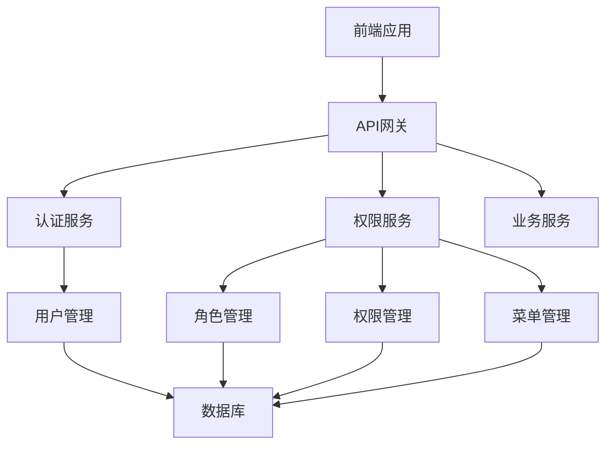

# 权限管理系统设计文档

## 1. 系统架构

### 1.1 整体架构



### 1.2 分层结构

- **前端层**：负责用户界面展示和交互
- **API网关层**：负责请求路由和认证拦截
- **服务层**：包括认证服务、权限服务和业务服务
- **数据层**：负责数据存储和管理

### 1.3 核心概念

- **用户**：系统的使用者
- **角色**：权限的集合
- **权限**：对资源的操作许可
- **菜单**：前端导航菜单
- **资源**：系统中的各种功能和数据

## 2. 数据模型

### 2.1 用户表 (users)

| 字段名 | 数据类型 | 描述 |
| :--- | :--- | :--- |
| `id` | `INT` | 用户ID |
| `username` | `VARCHAR(50)` | 用户名 |
| `password_hash` | `VARCHAR(100)` | 密码哈希 |
| `email` | `VARCHAR(100)` | 邮箱 |
| `created_at` | `DATETIME` | 创建时间 |
| `updated_at` | `DATETIME` | 更新时间 |

### 2.2 角色表 (roles)

| 字段名 | 数据类型 | 描述 |
| :--- | :--- | :--- |
| `id` | `INT` | 角色ID |
| `name` | `VARCHAR(50)` | 角色名称 |
| `description` | `VARCHAR(200)` | 角色描述 |
| `created_at` | `DATETIME` | 创建时间 |
| `updated_at` | `DATETIME` | 更新时间 |

### 2.3 权限表 (permissions)

| 字段名 | 数据类型 | 描述 |
| :--- | :--- | :--- |
| `id` | `INT` | 权限ID |
| `name` | `VARCHAR(50)` | 权限名称 |
| `code` | `VARCHAR(50)` | 权限代码 |
| `description` | `VARCHAR(200)` | 权限描述 |
| `created_at` | `DATETIME` | 创建时间 |
| `updated_at` | `DATETIME` | 更新时间 |

### 2.4 菜单表 (menus)

| 字段名 | 数据类型 | 描述 |
| :--- | :--- | :--- |
| `id` | `INT` | 菜单ID |
| `name` | `VARCHAR(50)` | 菜单名称 |
| `path` | `VARCHAR(100)` | 菜单路径 |
| `component` | `VARCHAR(100)` | 组件路径 |
| `icon` | `VARCHAR(50)` | 菜单图标 |
| `parent_id` | `INT` | 父菜单ID |
| `order` | `INT` | 排序 |
| `created_at` | `DATETIME` | 创建时间 |
| `updated_at` | `DATETIME` | 更新时间 |

### 2.5 用户角色关联表 (user_roles)

| 字段名 | 数据类型 | 描述 |
| :--- | :--- | :--- |
| `user_id` | `INT` | 用户ID |
| `role_id` | `INT` | 角色ID |

### 2.6 角色权限关联表 (role_permissions)

| 字段名 | 数据类型 | 描述 |
| :--- | :--- | :--- |
| `role_id` | `INT` | 角色ID |
| `permission_id` | `INT` | 权限ID |

### 2.7 角色菜单关联表 (role_menus)

| 字段名 | 数据类型 | 描述 |
| :--- | :--- | :--- |
| `role_id` | `INT` | 角色ID |
| `menu_id` | `INT` | 菜单ID |

## 3. 前端菜单管理

### 3.1 菜单树结构

前端菜单采用树形结构，支持多级嵌套。菜单数据从后端获取，根据用户角色动态生成。

### 3.2 动态渲染

- **路由配置**：前端路由根据菜单配置动态生成
- **权限控制**：菜单显示根据用户权限动态控制
- **缓存策略**：菜单数据缓存，减少重复请求

### 3.3 菜单管理界面

- **菜单列表**：展示所有菜单，支持分页和搜索
- **菜单编辑**：添加、修改、删除菜单
- **菜单排序**：调整菜单顺序
- **权限关联**：为菜单分配权限

### 3.4 前端权限控制

- **路由守卫**：拦截未授权的路由访问
- **按钮权限**：根据用户权限控制按钮显示
- **数据权限**：根据用户权限过滤数据

## 4. 后端权限管理

### 4.1 权限验证中间件

- **JWT认证**：验证用户身份
- **权限检查**：验证用户是否有权限访问资源
- **日志记录**：记录权限验证过程

### 4.2 角色管理

- **角色创建**：创建新角色
- **角色编辑**：修改角色信息
- **角色删除**：删除角色
- **角色权限分配**：为角色分配权限

### 4.3 权限管理

- **权限创建**：创建新权限
- **权限编辑**：修改权限信息
- **权限删除**：删除权限
- **权限分类**：对权限进行分类管理

### 4.4 权限自动生成与管理

#### 4.4.1 自动扫描路由生成权限

**原理**：在项目启动时，自动扫描所有注册的路由，根据路由路径和HTTP方法生成对应的权限代码。

**实现步骤**：
1. **路由扫描**：遍历所有注册的路由，提取完整路径和HTTP方法
2. **路径参数处理**：将路径参数（如`{id}`）转换为固定标识
3. **权限代码生成**：根据规则生成权限代码，如`user:list`、`user:create`等
4. **权限同步**：检查数据库中是否存在该权限，不存在则创建

**权限生成规则**：
- `GET /users` → `user:list`
- `GET /users/{id}` → `user:read`
- `POST /users` → `user:create`
- `PUT /users/{id}` → `user:update`
- `DELETE /users/{id}` → `user:delete`
- `POST /users/{id}/roles` → `user:assign_roles`

**处理相同路径和方法的多个处理函数**：
当同一个路由路径有多个相同HTTP方法的处理函数时，需要确保生成的权限代码唯一。处理方案：

1. **基于完整路径生成**：
   - 不仅考虑HTTP方法和资源，还要考虑完整的路径结构
   - 例如：`GET /users` → `user:list`，`GET /users/search` → `user:search`

2. **路径参数处理**：
   - 将路径参数（如`{id}`）转换为固定标识
   - 例如：`/users/{id}` → `user:read`，`/users/{id}/roles` → `user:roles:read`

3. **自定义规则映射**：
   - 为特殊路由设置自定义权限代码
   - 例如：`POST /users/login` → `auth:login` 而不是 `user:create`

4. **权限去重**：
   - 确保生成的权限代码唯一
   - 对相同功能的路由使用相同的权限代码

**示例实现**：
```python
def generate_permission_code(method, path):
    # 处理路径参数
    path = path.replace("{id}", ":id")
    
    # 特殊路由映射
    special_routes = {
        "/auth/login": "auth:login",
        "/auth/logout": "auth:logout",
    }
    
    if path in special_routes:
        return special_routes[path]
    
    # 提取资源和操作
    parts = path.strip('/').split('/')
    resource = parts[0]
    action = method.lower()
    
    # 处理子资源
    if len(parts) > 1:
        if parts[1] == ":id" and len(parts) > 2:
            # 如 /users/:id/roles
            sub_resource = parts[2]
            return f"{resource}:{sub_resource}:{action}"
        elif parts[1] != ":id":
            # 如 /users/list
            return f"{resource}:{parts[1]}:{action}"
    
    # 标准资源操作
    if action == "get":
        if ":id" in path:
            return f"{resource}:read"
        else:
            return f"{resource}:list"
    elif action == "post":
        if ":id" in path:
            return f"{resource}:update"
        else:
            return f"{resource}:create"
    elif action == "put":
        return f"{resource}:update"
    elif action == "delete":
        return f"{resource}:delete"
    else:
        return f"{resource}:{action}"
```

#### 4.4.2 后台管理界面

**原理**：提供权限管理的CRUD接口，通过后台界面手动管理权限。

**功能**：
- **权限列表**：展示所有权限，支持分页和搜索
- **权限创建**：手动创建新权限
- **权限编辑**：修改权限信息
- **权限删除**：删除不需要的权限
- **权限分类**：对权限进行分类管理

#### 4.4.3 权限缓存

- **内存缓存**：将权限信息缓存到内存，提高权限检查性能
- **缓存更新**：当权限发生变化时，自动更新缓存

### 4.5 安全控制

- **密码加密**：用户密码加密存储
- **HTTPS**：使用HTTPS传输数据
- **防SQL注入**：使用参数化查询
- **防XSS攻击**：对输入进行过滤

## 5. API接口设计

### 5.1 认证接口

| 接口路径 | 方法 | 描述 |
| :--- | :--- | :--- |
| `/api/auth/login` | `POST` | 用户登录 |
| `/api/auth/logout` | `POST` | 用户登出 |
| `/api/auth/refresh` | `POST` | 刷新token |
| `/api/auth/me` | `GET` | 获取当前用户信息 |

### 5.2 用户管理接口

| 接口路径 | 方法 | 描述 |
| :--- | :--- | :--- |
| `/api/users` | `GET` | 获取用户列表 |
| `/api/users` | `POST` | 创建用户 |
| `/api/users/:id` | `GET` | 获取用户详情 |
| `/api/users/:id` | `PUT` | 修改用户信息 |
| `/api/users/:id` | `DELETE` | 删除用户 |
| `/api/users/:id/roles` | `GET` | 获取用户角色 |
| `/api/users/:id/roles` | `POST` | 分配用户角色 |

### 5.3 角色管理接口

| 接口路径 | 方法 | 描述 |
| :--- | :--- | :--- |
| `/api/roles` | `GET` | 获取角色列表 |
| `/api/roles` | `POST` | 创建角色 |
| `/api/roles/:id` | `GET` | 获取角色详情 |
| `/api/roles/:id` | `PUT` | 修改角色信息 |
| `/api/roles/:id` | `DELETE` | 删除角色 |
| `/api/roles/:id/permissions` | `GET` | 获取角色权限 |
| `/api/roles/:id/permissions` | `POST` | 分配角色权限 |
| `/api/roles/:id/menus` | `GET` | 获取角色菜单 |
| `/api/roles/:id/menus` | `POST` | 分配角色菜单 |

### 5.4 权限管理接口

| 接口路径 | 方法 | 描述 |
| :--- | :--- | :--- |
| `/api/permissions` | `GET` | 获取权限列表 |
| `/api/permissions` | `POST` | 创建权限 |
| `/api/permissions/:id` | `GET` | 获取权限详情 |
| `/api/permissions/:id` | `PUT` | 修改权限信息 |
| `/api/permissions/:id` | `DELETE` | 删除权限 |

### 5.5 菜单管理接口

| 接口路径 | 方法 | 描述 |
| :--- | :--- | :--- |
| `/api/menus` | `GET` | 获取菜单列表 |
| `/api/menus` | `POST` | 创建菜单 |
| `/api/menus/:id` | `GET` | 获取菜单详情 |
| `/api/menus/:id` | `PUT` | 修改菜单信息 |
| `/api/menus/:id` | `DELETE` | 删除菜单 |
| `/api/menus/tree` | `GET` | 获取菜单树 |

## 6. 权限验证流程

### 6.1 登录流程

1. 用户输入用户名和密码
2. 前端发送登录请求到后端
3. 后端验证用户身份，生成JWT token
4. 前端存储token，并获取用户信息和权限
5. 前端根据用户权限生成菜单

### 6.2 权限验证流程

1. 用户访问某个资源
2. 前端路由守卫检查用户是否登录
3. 前端发送请求到后端，携带JWT token
4. 后端API网关验证token
5. 后端权限中间件检查用户是否有权限访问该资源
6. 后端返回结果给前端
7. 前端根据结果展示数据或提示权限不足

### 6.3 权限分配流程

1. 管理员登录系统
2. 进入角色管理页面
3. 选择一个角色，点击权限分配
4. 在权限分配界面，选择该角色需要的权限
5. 点击保存，后端更新角色权限关联
6. 该角色下的所有用户自动获得新的权限

## 7. 技术栈

### 7.1 前端技术

- **框架**：Vue 3
- **状态管理**：Pinia
- **路由**：Vue Router
- **UI组件**：Element Plus
- **HTTP客户端**：Axios
- **JWT处理**：jsonwebtoken

### 7.2 后端技术

- **语言**：Python 3.12
- **框架**：FastAPI
- **数据库**：MySQL
- **缓存**：Redis
- **认证**：JWT
- **密码加密与验证**：bcrypt模块
- **ORM**：SQLAlchemy

## 8. 项目结构

### 8.1 前端项目结构

```
frontend/
├── public/              # 静态资源
│   ├── favicon.ico
│   └── index.html
├── src/                 # 源代码
│   ├── assets/          # 静态资源
│   │   ├── css/         # 样式文件
│   │   └── images/      # 图片资源
│   ├── components/      # 公共组件
│   │   ├── layout/      # 布局组件
│   │   └── common/      # 通用组件
│   ├── views/           # 页面组件
│   │   ├── dashboard/   # 首页
│   │   └── user/        # 用户管理
│   │       ├── UserList.vue       # 用户列表
│   │       ├── RoleList.vue       # 角色列表
│   │       └── PermissionList.vue # 权限列表
│   ├── router/          # 路由配置
│   │   └── index.js     # 路由定义
│   ├── store/           # 状态管理
│   │   ├── modules/     # 模块状态
│   │   │   ├── user.js  # 用户状态
│   │   │   ├── role.js  # 角色状态
│   │   │   └── menu.js  # 菜单状态
│   │   └── index.js     # 状态管理配置
│   ├── api/             # API请求
│   │   ├── auth.js      # 认证相关
│   │   ├── user.js      # 用户相关
│   │   ├── role.js      # 角色相关
│   │   ├── permission.js # 权限相关
│   │   └── menu.js      # 菜单相关
│   ├── utils/           # 工具函数
│   │   ├── request.js   # 请求封装
│   │   ├── auth.js      # 认证工具
│   │   └── permission.js # 权限工具
│   ├── directives/      # 自定义指令
│   │   └── permission.js # 权限指令
│   ├── guards/          # 路由守卫
│   │   └── auth.js      # 认证守卫
│   ├── App.vue          # 根组件
│   └── main.js          # 入口文件
├── .env                 # 环境变量
├── .env.production      # 生产环境变量
├── package.json         # 项目配置
├── vite.config.js       # Vite配置
└── README.md            # 项目说明
```

### 8.2 后端项目结构

```
backend/
├── app/                 # 应用目录
│   ├── __init__.py      # 包初始化文件
│   ├── api/             # API路由
│   │   ├── __init__.py  # 包初始化文件
│   │   ├── v1/          # API版本
│   │   │   ├── __init__.py  # 包初始化文件
│   │   │   ├── auth.py  # 认证相关
│   │   │   ├── user.py  # 用户相关
│   │   │   ├── role.py  # 角色相关
│   │   │   ├── permission.py # 权限相关
│   │   │   └── menu.py  # 菜单相关
│   │   └── router.py    # 路由配置
│   ├── core/            # 核心模块
│   │   ├── __init__.py  # 包初始化文件
│   │   ├── config.yaml  # 配置文件
│   │   ├── config.py    # 配置管理
│   │   ├── security.py  # 安全相关
│   │   └── database.py  # 数据库连接
│   ├── models/          # 数据模型
│   │   ├── __init__.py  # 包初始化文件
│   │   ├── user.py      # 用户模型
│   │   ├── role.py      # 角色模型
│   │   ├── permission.py # 权限模型
│   │   ├── menu.py      # 菜单模型
│   │   └── base.py      # 基础模型
│   ├── schemas/         # 数据验证
│   │   ├── __init__.py  # 包初始化文件
│   │   ├── user.py      # 用户相关
│   │   ├── role.py      # 角色相关
│   │   ├── permission.py # 权限相关
│   │   └── menu.py      # 菜单相关
│   ├── services/        # 业务逻辑
│   │   ├── __init__.py  # 包初始化文件
│   │   ├── auth_service.py # 认证服务
│   │   ├── user_service.py # 用户服务
│   │   ├── role_service.py # 角色服务
│   │   ├── permission_service.py # 权限服务
│   │   ├── menu_service.py # 菜单服务
│   │   └── permission_scanner.py # 权限自动扫描服务
│   ├── middlewares/     # 中间件
│   │   ├── __init__.py  # 包初始化文件
│   │   ├── auth.py      # 认证中间件
│   │   └── cors.py      # CORS中间件
│   ├── utils/           # 工具函数
│   │   ├── __init__.py  # 包初始化文件
│   │   ├── password.py  # 密码工具
│   │   ├── jwt.py       # JWT工具
│   │   └── permission.py # 权限工具
│   └── main.py          # 应用入口
├── migrations/          # 数据库迁移
│   └── __init__.py      # 包初始化文件
├── requirements.txt     # 依赖包
└── README.md            # 项目说明
```

## 8. 部署方案

### 8.1 环境要求

- **前端**：Node.js 14+，npm 6+
- **后端**：Python 3.8+ / Java 11+ / Node.js 14+
- **数据库**：MySQL 5.7+ / PostgreSQL 10+
- **缓存**：Redis 5.0+

### 8.2 部署步骤

1. **前端部署**：
   - 构建前端项目：`npm run build`
   - 将构建产物部署到静态文件服务器

2. **后端部署**：
   - 安装依赖：`pip install -r requirements.txt` / `mvn install` / `npm install`
   - 启动服务：`uvicorn main:app --host 0.0.0.0 --port 8000` / `java -jar app.jar` / `node app.js`

3. **数据库部署**：
   - 创建数据库：`CREATE DATABASE permission_system;
   - 执行数据库迁移：`alembic upgrade head` / `mvn flyway:migrate` / `npx sequelize db:migrate`

4. **配置文件**：
   - 配置config.yaml文件
   - 配置数据库连接
   - 配置JWT密钥
   - 配置CORS设置

## 9. 监控和维护

### 9.1 日志管理

- **前端日志**：使用console.log和第三方日志服务
- **后端日志**：使用结构化日志，记录请求和错误
- **日志分析**：使用ELK Stack分析日志

### 9.2 性能监控

- **前端性能**：使用Lighthouse和Web Vitals
- **后端性能**：使用Prometheus和Grafana
- **数据库性能**：使用慢查询日志和性能分析工具

### 9.3 安全监控

- **漏洞扫描**：定期使用安全扫描工具
- **入侵检测**：使用WAF和IDS
- **安全审计**：定期进行安全审计

## 10. 初始化数据

### 10.1 初始化用户

| 用户名 | 密码 | 角色 | 描述 |
| :--- | :--- | :--- | :--- |
| `admin` | `root123` | `admin` | 系统管理员，拥有所有权限 |

### 10.2 初始化角色

| 角色名称 | 描述 |
| :--- | :--- |
| `admin` | 系统管理员角色，拥有所有权限 |
| `common` | 普通用户角色，拥有基础权限 |

### 10.3 初始化菜单

#### 一级菜单

| 菜单名称 | 路径 | 组件 | 图标 | 排序 |
| :--- | :--- | :--- | :--- | :--- |
| `首页` | `/dashboard` | `Dashboard` | `home` | 1 |
| `用户管理` | `/user` | `User` | `user` | 2 |

#### 二级菜单

| 菜单名称 | 路径 | 组件 | 图标 | 父菜单 | 排序 |
| :--- | :--- | :--- | :--- | :--- | :--- |
| `用户管理` | `/user/list` | `UserList` | `user` | `用户管理` | 1 |
| `角色管理` | `/user/role` | `RoleList` | `role` | `用户管理` | 2 |
| `权限管理` | `/user/permission` | `PermissionList` | `permission` | `用户管理` | 3 |

### 10.4 初始化权限

#### 用户管理权限

| 权限名称 | 权限代码 | 描述 |
| :--- | :--- | :--- |
| `获取用户列表` | `user:list` | 查看用户列表 |
| `创建用户` | `user:create` | 创建新用户 |
| `获取用户详情` | `user:detail` | 查看用户详细信息 |
| `修改用户信息` | `user:update` | 修改用户信息 |
| `删除用户` | `user:delete` | 删除用户 |
| `获取用户角色` | `user:roles` | 查看用户所属角色 |
| `分配用户角色` | `user:assign_roles` | 为用户分配角色 |

#### 角色管理权限

| 权限名称 | 权限代码 | 描述 |
| :--- | :--- | :--- |
| `获取角色列表` | `role:list` | 查看角色列表 |
| `创建角色` | `role:create` | 创建新角色 |
| `获取角色详情` | `role:detail` | 查看角色详细信息 |
| `修改角色信息` | `role:update` | 修改角色信息 |
| `删除角色` | `role:delete` | 删除角色 |
| `获取角色权限` | `role:permissions` | 查看角色拥有的权限 |
| `分配角色权限` | `role:assign_permissions` | 为角色分配权限 |
| `获取角色菜单` | `role:menus` | 查看角色拥有的菜单 |
| `分配角色菜单` | `role:assign_menus` | 为角色分配菜单 |

#### 权限管理权限

| 权限名称 | 权限代码 | 描述 |
| :--- | :--- | :--- |
| `获取权限列表` | `permission:list` | 查看权限列表 |
| `创建权限` | `permission:create` | 创建新权限 |
| `获取权限详情` | `permission:detail` | 查看权限详细信息 |
| `修改权限信息` | `permission:update` | 修改权限信息 |
| `删除权限` | `permission:delete` | 删除权限 |

#### 菜单管理权限

| 权限名称 | 权限代码 | 描述 |
| :--- | :--- | :--- |
| `获取菜单列表` | `menu:list` | 查看菜单列表 |
| `创建菜单` | `menu:create` | 创建新菜单 |
| `获取菜单详情` | `menu:detail` | 查看菜单详细信息 |
| `修改菜单信息` | `menu:update` | 修改菜单信息 |
| `删除菜单` | `menu:delete` | 删除菜单 |
| `获取菜单树` | `menu:tree` | 获取菜单树形结构 |

## 11. 总结

本权限管理系统设计文档提供了一套完整的权限管理解决方案，包括前端菜单管理和后端权限管理。系统采用了基于角色的权限控制（RBAC）模型，实现了用户、角色、权限、菜单的管理和关联。通过JWT认证和权限验证中间件，确保了系统的安全性。前端采用动态菜单渲染，后端采用模块化设计，提高了系统的可维护性和扩展性。

该设计文档可以作为权限管理系统开发的参考，根据具体项目需求进行适当调整和扩展。